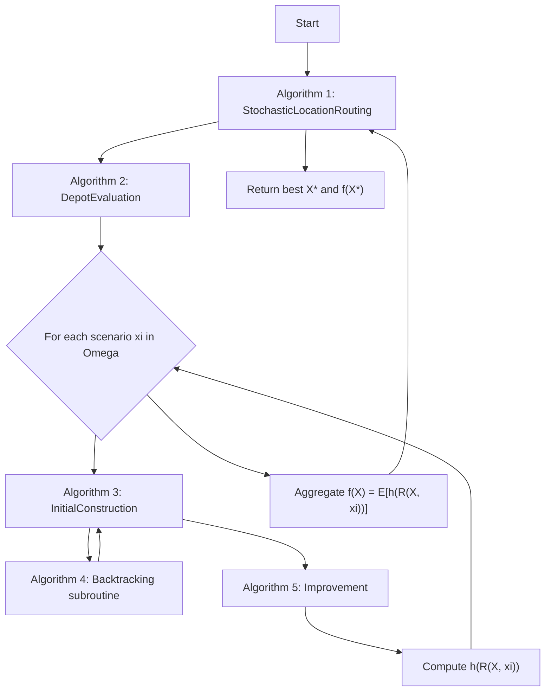
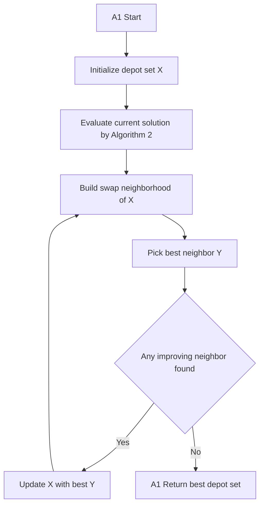
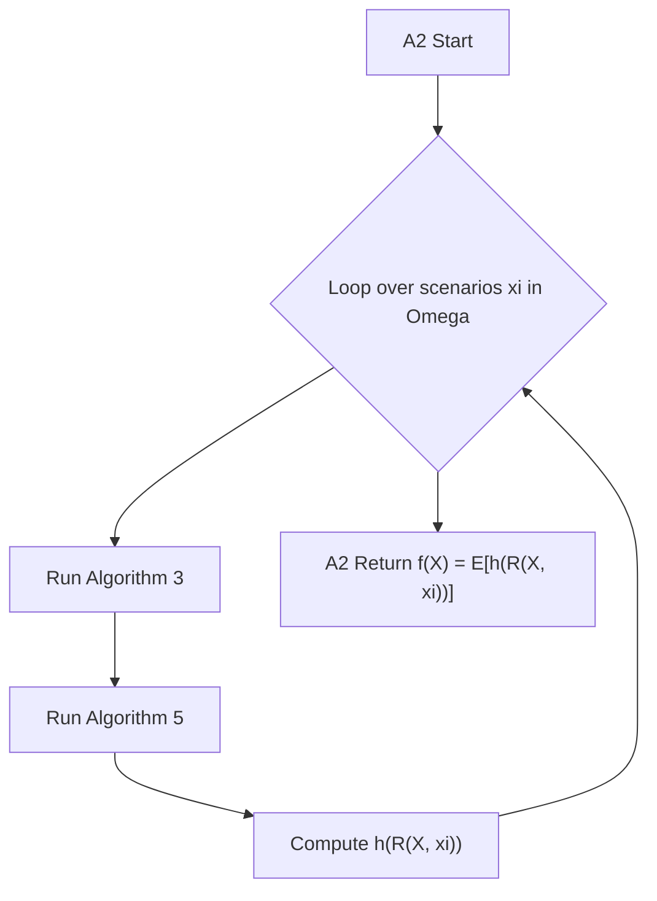
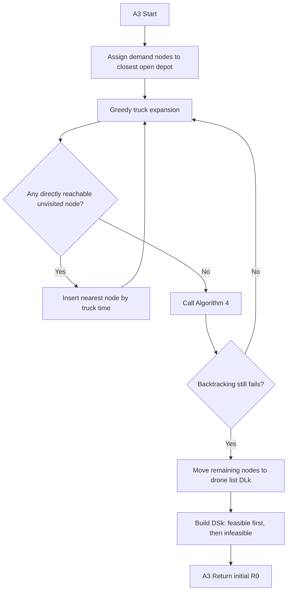
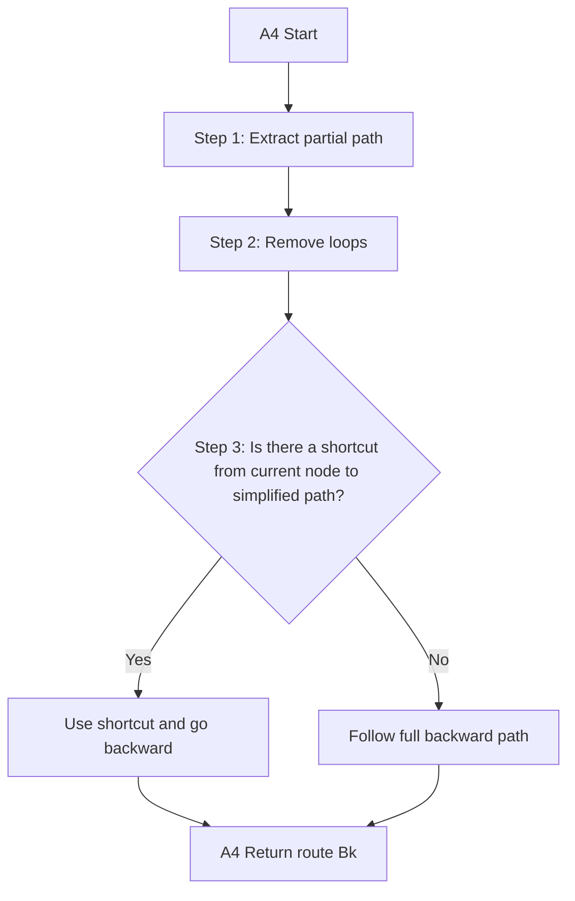
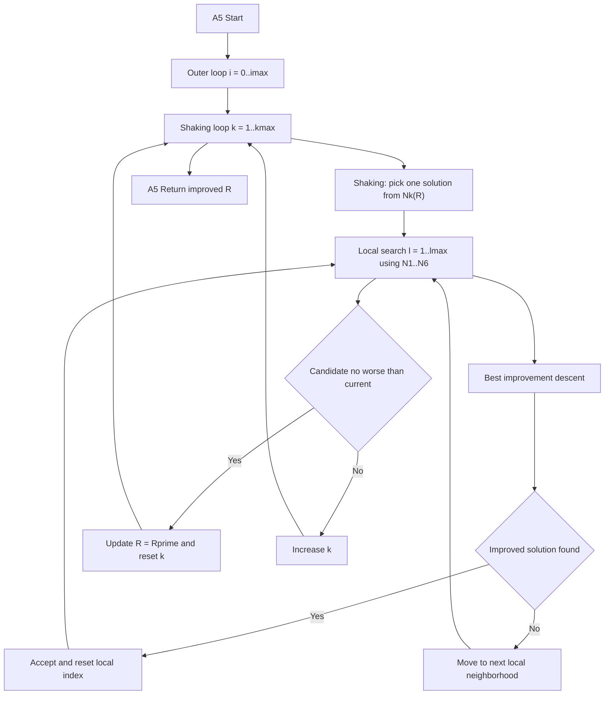

# Two-Stage Model and Algorithms (A1-A5)

## Overall Workflow (A1-A5 Integration)

```mermaid
graph TD
    S["Start"] --> A1["Algorithm 1: StochasticLocationRouting"]
    A1 --> A2["Algorithm 2: DepotEvaluation"]
    A2 --> L1{"For each scenario xi in Omega"}
    L1 --> A3["Algorithm 3: InitialConstruction"]
    A3 --> A4["Algorithm 4: Backtracking subroutine"]
    A4 --> A3
    A3 --> A5["Algorithm 5: Improvement"]
    A5 --> H["Compute h(R(X, xi))"]
    H --> L1
    L1 --> EX["Aggregate f(X) = E[h(R(X, xi))]"]
    EX --> A1
    A1 --> END["Return best X* and f(X*)"]
```

## Algorithm 1

```mermaid
graph TD
    A1S["A1 Start"] --> A1I["Initialize depot set X"]
    A1I --> A1E["Evaluate current solution by Algorithm 2"]
    A1E --> A1N["Build swap neighborhood of X"]
    A1N --> A1B["Pick best neighbor Y"]
    A1B --> A1C{"Any improving neighbor found"}
    A1C -->|Yes| A1U["Update X with best Y"]
    A1C -->|No| A1R["A1 Return best depot set"]
    A1U --> A1N
```

## Algorithm 2

```mermaid
graph TD
    A2S["A2 Start"] --> A2L{"Loop over scenarios xi in Omega"}
    A2L --> A2A3["Run Algorithm 3"]
    A2A3 --> A2A5["Run Algorithm 5"]
    A2A5 --> A2H["Compute h(R(X, xi))"]
    A2H --> A2L
    A2L --> A2R["A2 Return f(X) = E[h(R(X, xi))]"]
```

## Algorithm 3

```mermaid
graph TD
    A3S["A3 Start"] --> A3D["Assign demand nodes to closest open depot"]
    A3D --> A3G["Greedy truck expansion"]
    A3G --> A3Q{Any directly reachable unvisited node?}
    A3Q -->|Yes| A3INS["Insert nearest node by truck time"]
    A3INS --> A3G
    A3Q -->|No| A3BT["Call Algorithm 4"]
    A3BT --> A3DE{Backtracking still fails?}
    A3DE -->|No| A3G
    A3DE -->|Yes| A3DR["Move remaining nodes to drone list DLk"]
    A3DR --> A3SCH["Build DSk: feasible first, then infeasible"]
    A3SCH --> A3R["A3 Return initial R0"]
```

## Algorithm 4

```mermaid
graph TD
    A4S["A4 Start"] --> A41["Step 1: Extract partial path"]
    A41 --> A42["Step 2: Remove loops"]
    A42 --> A43{Step 3: Is there a shortcut from current node to simplified path?}
    A43 -->|Yes| A44["Use shortcut and go backward"]
    A43 -->|No| A45["Follow full backward path"]
    A44 --> A4R["A4 Return route Bk"]
    A45 --> A4R
```

## Algorithm 5

```mermaid
graph TD
    A5S["A5 Start"] --> A5I["Outer loop i = 0..imax"]
    A5I --> A5K["Shaking loop k = 1..kmax"]
    A5K --> A5SH["Shaking: pick one solution from Nk(R)"]
    A5SH --> A5L["Local search l = 1..lmax using N1..N6"]
    A5L --> A5DESC["Best improvement descent"]
    A5DESC --> A5CHK{Improved solution found}
    A5CHK -->|Yes| A5RST["Accept and reset local index"]
    A5CHK -->|No| A5NEXT["Move to next local neighborhood"]
    A5RST --> A5L
    A5NEXT --> A5L
    A5L --> A5ACC{"Candidate no worse than current"}
    A5ACC -->|Yes| A5UPD["Update R = Rprime and reset k"]
    A5ACC -->|No| A5KINC["Increase k"]
    A5UPD --> A5K
    A5KINC --> A5K
    A5K --> A5R["A5 Return improved R"]
```
